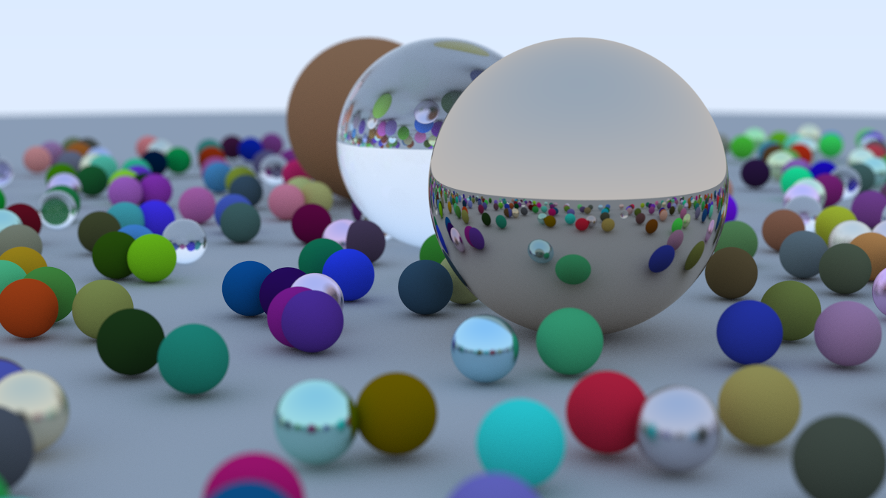

# Raytracer

- Based on: [Ray Tracing in One Weekend](https://raytracing.github.io/books/RayTracingInOneWeekend.html)
- Expanded on in the [UU Advanced Graphics](https://ics-websites.science.uu.nl/docs/vakken/magr/2024-2025) course

## Usage
```shell
cargo run --release -- scenes/weekend-final.json # Or another json scene
cargo run --release -- scenes/dragon_recon/dragon_vrip_res4.ply --format ply # Or another ply scene
```
This will load a scene from a file and render it to the `output` folder.
```shell
cargo run --release -- 
```
This will generate a new scene based on the code in `main.rs` (e.g. `let (world, filename) = scenes::simple_fuzzy_metal();`)  
It will write the scene as json to the `scenes` folder. (and also render to the `output` folder)

There are various possible options, most importantly, the algorithm for acceleration can be specified using
`--algorithm <ALGORITHM>`. Possible values are `naive` or `bvh`.

More options can be added using the `-o <OPTION>` flag.

For example `-o draw-boxes` draws the BVH bounding boxes.

```shell
cargo run --release -- --help # For a list of all options
```

## Tests
```shell
cargo test --release
```
This will run a set of scenes from the `scenes` folder with different algorithms and options.  
The simple scenes will be ran using the **naive** and **BVH** algorithms, more complex scenes will
not be run using the **naive** algorithm. For the **BVH** algorithm three different SAH settings will
be tested.

Any time a image is generated using any of the above commands, statistics are collected to `output/stats.csv`.

## Features / implementation details
- [x] All features from [Ray Tracing in One Weekend](https://raytracing.github.io/books/RayTracingInOneWeekend.html)
- [x] Triangle geometry and intersection based on [this tutorial](https://www.scratchapixel.com/lessons/3d-basic-rendering/ray-tracing-rendering-a-triangle/geometry-of-a-triangle.html)
- [x] BVH using SAH, based on slides from _Advanced Graphics_
- [x] Importing PLY files, for example the [Stanford Models](https://graphics.stanford.edu/data/3Dscanrep/)

## Acknowledgments
This repository includes some `ply` models from the [Stanford Models](https://graphics.stanford.edu/data/3Dscanrep/).
Specifically:
- Dragon:
  - Source: Stanford University Computer Graphics Laboratory
  -  Scanner: Cyberware 3030 MS + spacetime analysis

